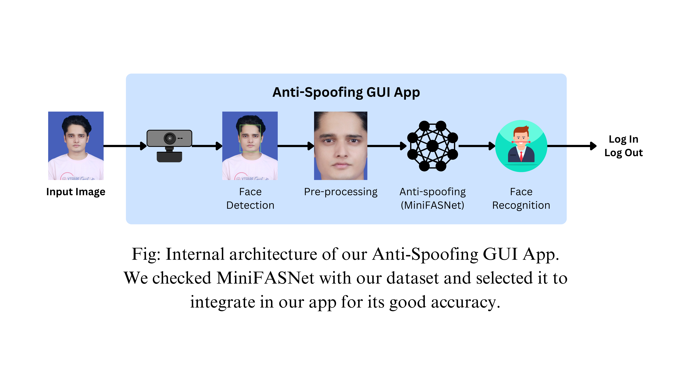

# Face Anti-Spoofing Attendance System 

This repository contains the source code for the **Face Anti-Spoofing System**, a real-time attendance authentication application designed and implemented as part of my Bachelor's thesis at Yangzhou University.

 

## Project Overview

The system is built around a lightweight **MiniFASNet** deep learning model, trained on a custom-developed dataset named **SARSpoof**, specifically curated with spoofing samples from South Asian individuals to reduce bias and improve accuracy.

Key components include:
- A **graphical user interface (GUI)** for user registration, login, and logout
- Integrated **spoof detection** and **face recognition** modules
- Real-world testing across different lighting, background, distance, and accessory scenarios
- Anti-spoofing protection against **print attacks** and **replay attacks**

 

 

---

## Key Features

-  **MiniFASNet Integration**: Lightweight and efficient CNN model for spoof detection
-  **Real-Time Detection**: Webcam-based face authentication and spoofing defense
-  **Logging**: Attendance data saved with timestamps in local log files
-  **Robust Evaluation**: Tested against diverse spoofing attempts (replay, print)
-  **Inclusive Design**: Tailored for the South Asian demographic

 

---

##  Tools & Technologies

- **Python 3.8**
- `opencv-python`, `face_recognition`, `dlib`, `torch`, `torchvision`
- GUI: `Tkinter`
- Dataset: Custom **SARSpoof Dataset** (200+ samples with attack variations)

- ## Note on Dataset Privacy

>  **IMPORTANT:**  
> The **SARSpoof dataset** used in this project is currently unpublished and sensitive.  
> For security and ethical reasons, this repository has been set to **private** and the dataset is **not included** here.  
> Access to the dataset can be requested on a case-by-case basis for academic purposes only.

 

---

##  Thesis Reference

This system was developed as part of my undergraduate thesis:
> **"Design and Implementation of Face Anti-Spoofing System"**  
> Department of Software Engineering, Yangzhou University  
> Supervised by: Dr. Meiling Fang

 

## Contact

- Raoha Bin Mejba
- Email: raoha@mail.ustc.edu.cn
